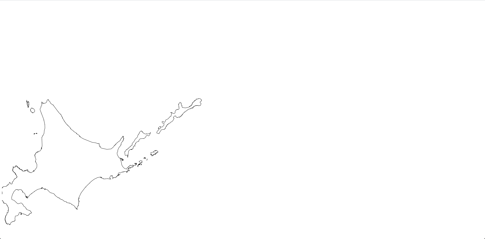

# README
このリポジトリは、D3.js x Topojsonの描画確認用のものです。

## 使い方
このプロジェクトをgit cloneした後、以下のコマンドを実行します。

```
$ yarn install
$ yarn webpack
$ yarn http-server -c-1
```

実行後、http://localhost:8080/ にアクセスすると以下のような画面が`hokkaido.topojson`を元に描画されていることを確認できるはずです。


